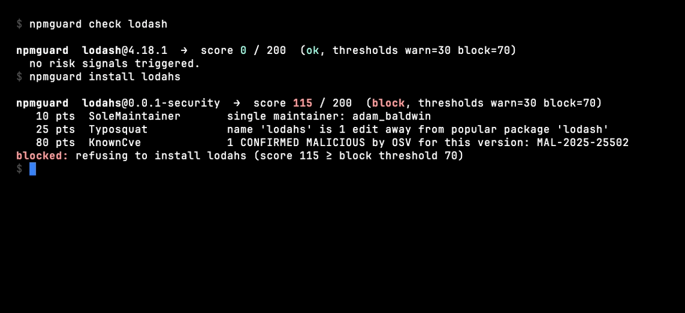
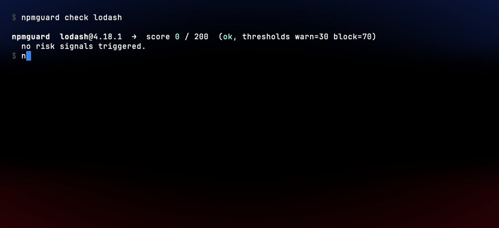

# npmguard

> A native safety gate for `npm install`, built for humans and AI coding agents.
> Pre-install risk scoring + MCP server, distributed outside the npm ecosystem so it can't be compromised by the thing it's protecting you from.

[](https://github.com/AyoubTadlaoui/npmguard/actions/workflows/ci.yml)
[](https://github.com/AyoubTadlaoui/npmguard/actions/workflows/release.yml)
[](https://github.com/AyoubTadlaoui/npmguard/releases/latest)
[](LICENSE)



`npmguard install lodahs` — a real typosquat of `lodash`, refused before lifecycle scripts can run:

<!--
  Animated GIF — recorded with vhs from docs/demo.tape. GitHub's README
  sanitizer passes  through cleanly. The .tape file is checked in
  so anyone can regenerate the asset with the same atlas-ragnarok theme.
-->


<sub>Live verdict against the npm registry — `lodahs` is in OSV's malware namespace (`MAL-2025-25502`). Theme: [atlas-ragnarok](https://github.com/AyoubTadlaoui/atlas-ragnarok). Regenerate with `vhs docs/demo.tape`.</sub>

---

## Why

Across 2025–2026 the npm ecosystem absorbed a series of worm-style supply chain attacks that ran inside `preinstall` / `install` / `postinstall` scripts the moment a downstream user ran `npm install` — Shai-Hulud (Sep 2025), SHA1-Hulud (Nov 2025), the Axios compromise (Mar 2026), Mini Shai-Hulud (May 2026). Defender wins or loses **before the install completes**, not after.

Existing defenses leave a specific gap:

- **`npq`, `safe-npm` / `socket npm`, `npm-risk`** ship as **npm packages**. They run on the thing they're protecting you from. If the wrapper is ever compromised, you've made the problem worse.
- **`pnpm v10+`, Bun** disable lifecycle scripts by default — but only for users who've moved off `npm`. The npm majority is unprotected.
- **`npm audit`, Snyk, Dependabot, `lavamoat/allow-scripts`** are excellent at CVE scanning and allow-list management, but they're not a pre-install heuristic gate, and none of them gate AI coding assistants like Claude Code, Cursor, or Windsurf when *they* run `npm install` on your behalf.

`npmguard` fills the specific gap of **pre-install risk scoring + AI-agent gate via MCP, shipped as a single binary outside npm**. Zero external dependencies at runtime beyond the registries it queries.

---

## Install

Pick whichever fits your machine:

```bash
# macOS (Apple Silicon)
curl -L -o npmguard.tar.gz \
  https://github.com/AyoubTadlaoui/npmguard/releases/latest/download/npmguard-v0.1.0-aarch64-apple-darwin.tar.gz
tar -xzf npmguard.tar.gz
sudo mv npmguard-v0.1.0-aarch64-apple-darwin/npmguard*  /usr/local/bin/

# macOS (Intel)
#   https://github.com/AyoubTadlaoui/npmguard/releases/latest/download/npmguard-v0.1.0-x86_64-apple-darwin.tar.gz

# Linux (x86_64)
#   https://github.com/AyoubTadlaoui/npmguard/releases/latest/download/npmguard-v0.1.0-x86_64-unknown-linux-gnu.tar.gz

# Linux (aarch64)
#   https://github.com/AyoubTadlaoui/npmguard/releases/latest/download/npmguard-v0.1.0-aarch64-unknown-linux-gnu.tar.gz

# Windows (x86_64)
#   https://github.com/AyoubTadlaoui/npmguard/releases/latest/download/npmguard-v0.1.0-x86_64-pc-windows-msvc.zip

# Build from source (any OS with Rust ≥ 1.75)
cargo install --git https://github.com/AyoubTadlaoui/npmguard --bin npmguard
cargo install --git https://github.com/AyoubTadlaoui/npmguard --bin npmguard-mcp

# Prebuilt binaries
#   https://github.com/AyoubTadlaoui/npmguard/releases
```

Every release ships a `SHA256SUMS.txt` — verify before extracting:

```bash
shasum -a 256 -c <(grep npmguard-v0.1.0-aarch64-apple-darwin.tar.gz SHA256SUMS.txt)
```

Homebrew tap, Scoop bucket, `curl ... | sh` installer, AUR, and GHCR Docker image land with **v0.2** alongside the sandbox layer. See [DISTRIBUTION.md](DISTRIBUTION.md) (planned) for the full channel matrix.

---

## Quickstart — CLI

```bash
# Evaluate the latest version, no install.
npmguard check axios

# Pinned version, JSON output (machine-readable for CI).
npmguard check --json @ctrl/tinycolor@4.1.1

# Install path: v0.1 prints the verdict and stops; v0.2 will run `npm install`
# inside the sandbox layer if the verdict allows it.
npmguard install lodash@4.17.21

# Auto-accept warn-level (still refuses block-level).
npmguard install --yes some-fresh-package
```

Sample output, real live verdict against the registry:

```text
npmguard  lodahs@0.0.1-security  →  score 115 / 200  (block, thresholds warn=30 block=70)
   10 pts  SoleMaintainer       single maintainer: adam_baldwin
   25 pts  Typosquat            name 'lodahs' is 1 edit away from popular package 'lodash'
   80 pts  KnownCve             1 CONFIRMED MALICIOUS by OSV for this version: MAL-2025-25502
blocked: refusing to install lodahs (score 115 ≥ block threshold 70)
```

All flags:

| Flag | Default | Meaning |
|---|---|---|
| `--json` | `false` | Emit verdict as JSON instead of colored text |
| `--no-color` | `false` | Disable ANSI color escapes |
| `--no-cache` | `false` | Skip the local SQLite verdict cache |
| `-v` / `-vv` | `warn` | Increase log verbosity |
| `--yes` (install only) | `false` | Auto-accept warn-level verdicts; block-level still refuses |

---

## Quickstart — MCP

The `npmguard-mcp` binary speaks the Model Context Protocol over stdio. Add it to any MCP host (Claude Code shown):

```jsonc
// ~/.claude.json  (or your host's MCP config)
{
  "mcpServers": {
    "npmguard": {
      "command": "/usr/local/bin/npmguard-mcp"
    }
  }
}
```

It exposes one tool, `install_package(name, version?)`, returning a structured verdict the model can act on:

```json
{
  "package": "lodahs",
  "resolved_version": "0.0.1-security",
  "level": "block",
  "score": 115,
  "signals": [
    { "kind": "SoleMaintainer", "points": 10, "detail": "single maintainer: adam_baldwin" },
    { "kind": "Typosquat", "points": 25, "detail": "name 'lodahs' is 1 edit away from popular package 'lodash'" },
    { "kind": "KnownCve", "points": 80, "detail": "1 CONFIRMED MALICIOUS by OSV for this version: MAL-2025-25502" }
  ],
  "recommendation": "Block — do NOT install this package without explicit user override. Present the signals and ask the user to confirm."
}
```

The model gets the recommendation in its own message, so even if the user said *"just install whatever you need"*, the assistant has the structured signal to stop and ask.

---

## Risk signals

| Signal | Points | Triggered when |
|---|---|---|
| `LifecycleScripts` | 30 | Package defines `preinstall`, `install`, or `postinstall` |
| `PackageAge` | 25 / 10 | Version published < 7 / 30 days ago |
| `MaintainerChurn` | 20 | Version published after a > 180-day publish gap (dormant package resurrection) |
| `SoleMaintainer` | 10 | Package has exactly one maintainer |
| `RepoHealth` | 15 / 10 | Linked GitHub repo is archived / has zero stars and no commits in 6 months |
| `Typosquat` | 25 | Name is one Damerau-Levenshtein edit from a popular package (catches char swaps like `lodahs`↔`lodash`) |
| `KnownCve` | 80 / 50 / 20 / 10 / 5 | OSV.dev advisory present. **80** if it's a `MAL-*` (OSV's confirmed-malicious-package namespace). Otherwise CVSS critical / high / medium / low. |
| `Deprecated` | 10 | npm registry marks this version deprecated |

Composite score is the sum (capped at 200). Default thresholds: `warn ≥ 30`, `block ≥ 70`. Tunable per project via config (planned for v0.2).

**Weights are starting values, not science.** They will be tuned against [`corpus/`](corpus/) and the values published as part of each release. PRs welcome.

---

## What npmguard does NOT do

Honesty is the contract.

- **Does not** catch attacks that pass all heuristic checks. A clean-history maintainer-account-takeover that ships a package matching every "looks normal" signal will still install.
- **Does not** protect against zero-day vulnerabilities in legitimate packages. That's `npm audit` / Snyk territory.
- **Does not** stop attacks that run **outside** lifecycle scripts. If a package is malicious only when imported and used at runtime, this tool isn't there.
- **Does not** replace `npm audit`, Snyk, Socket, Dependabot, or code review. It's an additional layer.
- **Does not** yet sandbox lifecycle scripts. v0.1 surfaces the verdict; v0.2 adds the sandbox + real `npm install` execution.
- Is **not** a guarantee. Any tool claiming "secure" is lying. This one says "reduces blast radius" and stops there.

---

## Versioning & releases

npmguard follows [Semantic Versioning](https://semver.org/). While the project is `0.x`:

- The CLI is treated as stable for end users — flag names and exit codes won't change without a major bump.
- The MCP tool surface (`install_package` input/output schema) may make minor additive changes between `0.x` releases. Anything breaking is called out in [CHANGELOG.md](CHANGELOG.md) (planned).

Tagged releases publish prebuilt binaries to the [Releases](https://github.com/AyoubTadlaoui/npmguard/releases) page (macOS x86_64 + arm64, Linux x86_64 + arm64, Windows x86_64) via a cross-platform GitHub Actions matrix.

Roadmap:

| Phase | Scope |
|---|---|
| **v0.1** (now) | Risk engine + CLI + MCP server + SQLite cache + GitHub Releases |
| **v0.2** | Sandbox layer (landlock / sandbox-exec / Job Object) + real `npm install` execution + Homebrew/Scoop/install.sh distribution |
| **v0.3** | Config file, custom signal weights, organization-wide policy bundles |

---

## Contributing

PRs and issues welcome. The short version:

```bash
cargo fmt --all
cargo clippy --workspace --all-targets -- -D warnings
cargo test --workspace
NPMGUARD_CORPUS=1 cargo test --test corpus -- --nocapture   # live network test
```

Open the PR once that's clean.

---

## License

MIT — see [LICENSE](LICENSE).

---

### About the author

**Ayoub Tadlaoui** — *Atlas Kaisar* — a problem-solver from Morocco, building software since 2016.

> "High performance knows no part-time commitment."
