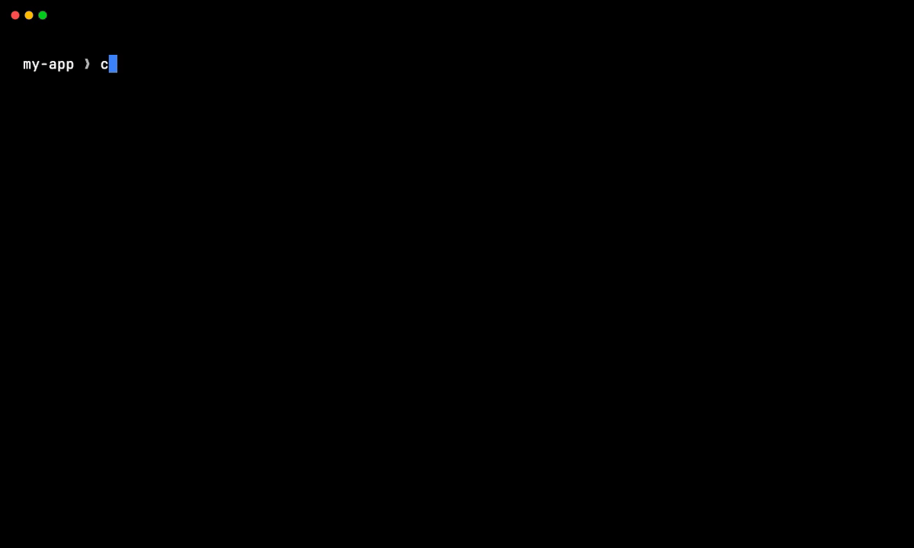
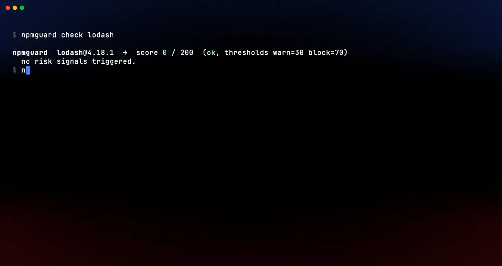

# npmguard

**I built this because my AI coding agent kept installing npm packages without asking. npmguard screens them before a single install script runs.**

Claude Code, Cursor, and Codex run `npm install` autonomously. Nobody pauses to ask "wait, is `supabase-mcp-helper` even real?" I built npmguard as an MCP server and CLI that scores every package (OSV malware data, typosquat/slopsquat, install-script analysis) and returns a verdict before lifecycle scripts fire.

It ships as one Rust binary, *outside* npm. That matters: the gate cant be poisoned by the supply chain its guarding.

[](https://github.com/AyoubTadlaoui/npmguard/actions/workflows/ci.yml)
[](https://github.com/AyoubTadlaoui/npmguard/actions/workflows/release.yml)
[](https://github.com/AyoubTadlaoui/npmguard/releases/latest)
[](LICENSE)



`npmguard install lodahs` is a real typosquat of `lodash`, refused before lifecycle scripts can run:

<!--
  Animated WebP renders as an  tag, which GitHub's README sanitizer
  passes through cleanly (it strips <video>). WebP plays in every modern
  browser including Safari. The MP4 and GIF copies are kept alongside
  for downloads (links below the image).
-->


<sub>Also available as [GIF](docs/demo.gif) or [MP4](docs/demo.mp4). Live verdict against the npm registry. `lodahs` is in OSV's malware namespace (`MAL-2025-25502`). Theme: [atlas-ragnarok](https://github.com/AyoubTadlaoui/atlas-ragnarok). Regenerate with `sh docs/_theme/gen.sh` (needs `vhs`, `ffmpeg`, `webp`, `pillow`, `numpy`).</sub>

---

## Why

Between 2025 and 2026 the npm ecosystem got hit by a string of worm-style supply chain attacks: Shai-Hulud (Sep 2025), SHA1-Hulud (Nov 2025), the Axios compromise (Mar 2026), Mini Shai-Hulud (May 2026). All of them ran inside `preinstall` / `install` / `postinstall` scripts the moment someone ran `npm install`. You win or lose before the install completes, not after.

The existing tools dont cover the gap I was staring at:

- **`npq`, `safe-npm` / `socket npm`, `npm-risk`** ship as **npm packages**. They run on the exact thing they're supposed to protect you from. If the wrapper gets compromised, you've made the situation worse.
- **`pnpm v10+`, Bun** disable lifecycle scripts by default, but only if you've already moved off `npm`. The npm majority is still exposed.
- **`npm audit`, Snyk, Dependabot, `lavamoat/allow-scripts`** do CVE scanning and allow-list management well. What they dont do is act as a pre-install heuristic gate, and none of them intercept AI coding assistants like Claude Code, Cursor, or Codex when *they* run `npm install` on your behalf.

That last one is the specific thing I wanted to fix: **pre-install risk scoring that also gates AI agents, shipped as a single binary outside npm**. Zero runtime dependencies beyond the registries it queries.

---

## Install

<details>
<summary><strong>macOS (Apple Silicon, aarch64)</strong></summary>

```bash
curl -L -o npmguard.tar.gz \
  https://github.com/AyoubTadlaoui/npmguard/releases/latest/download/npmguard-v0.1.4-aarch64-apple-darwin.tar.gz
tar -xzf npmguard.tar.gz
# Edit the directory name below if the version has changed.
sudo mv npmguard-v0.1.4-aarch64-apple-darwin/npmguard-cli  /usr/local/bin/npmguard
sudo mv npmguard-v0.1.4-aarch64-apple-darwin/npmguard-mcp  /usr/local/bin/npmguard-mcp
```

> **Quarantine note:** if you downloaded through a browser rather than `curl`, macOS may flag the binary as untrusted (`"cannot be opened…"` or `Killed: 9`). Clear the attribute after extracting:
> ```bash
> xattr -dr com.apple.quarantine /usr/local/bin/npmguard /usr/local/bin/npmguard-mcp
> ```
> The `curl` path above avoids this; `curl` does not set the quarantine flag.

</details>

<details>
<summary><strong>macOS (Intel, x86_64)</strong></summary>

```bash
curl -L -o npmguard.tar.gz \
  https://github.com/AyoubTadlaoui/npmguard/releases/latest/download/npmguard-v0.1.4-x86_64-apple-darwin.tar.gz
tar -xzf npmguard.tar.gz
# Edit the directory name below if the version has changed.
sudo mv npmguard-v0.1.4-x86_64-apple-darwin/npmguard-cli  /usr/local/bin/npmguard
sudo mv npmguard-v0.1.4-x86_64-apple-darwin/npmguard-mcp  /usr/local/bin/npmguard-mcp
```

</details>

<details>
<summary><strong>Linux (x86_64)</strong></summary>

```bash
curl -L -o npmguard.tar.gz \
  https://github.com/AyoubTadlaoui/npmguard/releases/latest/download/npmguard-v0.1.4-x86_64-unknown-linux-gnu.tar.gz
tar -xzf npmguard.tar.gz
# Edit the directory name below if the version has changed.
sudo mv npmguard-v0.1.4-x86_64-unknown-linux-gnu/npmguard-cli  /usr/local/bin/npmguard
sudo mv npmguard-v0.1.4-x86_64-unknown-linux-gnu/npmguard-mcp  /usr/local/bin/npmguard-mcp
```

</details>

<details>
<summary><strong>Linux (aarch64)</strong></summary>

```bash
curl -L -o npmguard.tar.gz \
  https://github.com/AyoubTadlaoui/npmguard/releases/latest/download/npmguard-v0.1.4-aarch64-unknown-linux-gnu.tar.gz
tar -xzf npmguard.tar.gz
# Edit the directory name below if the version has changed.
sudo mv npmguard-v0.1.4-aarch64-unknown-linux-gnu/npmguard-cli  /usr/local/bin/npmguard
sudo mv npmguard-v0.1.4-aarch64-unknown-linux-gnu/npmguard-mcp  /usr/local/bin/npmguard-mcp
```

</details>

<details>
<summary><strong>Windows (x86_64)</strong></summary>

Download the zip from:
```
https://github.com/AyoubTadlaoui/npmguard/releases/latest/download/npmguard-v0.1.4-x86_64-pc-windows-msvc.zip
```
Extract and place `npmguard-cli.exe` and `npmguard-mcp.exe` somewhere on your `%PATH%`, e.g. `C:\tools\`.

> **Edit the version string** in the URL above if you want a specific release.

</details>

<details>
<summary><strong>Build from source (Rust users)</strong></summary>

Requires Rust 1.75 or later.

```bash
cargo install --git https://github.com/AyoubTadlaoui/npmguard --bin npmguard-cli
cargo install --git https://github.com/AyoubTadlaoui/npmguard --bin npmguard-mcp
```

After install, the CLI binary is named `npmguard-cli`; alias it if you prefer `npmguard`:
```bash
# bash / zsh
echo 'alias npmguard=npmguard-cli' >> ~/.bashrc   # or ~/.zshrc
```

</details>

Verify the download against the published checksums before extracting:

```bash
# Replace the filename to match your platform.
shasum -a 256 -c <(grep npmguard-v0.1.4-aarch64-apple-darwin.tar.gz SHA256SUMS.txt)
```

All prebuilt binaries are listed on the [Releases page](https://github.com/AyoubTadlaoui/npmguard/releases). Homebrew tap, Scoop bucket, and `curl … | sh` installer land with **v0.2** alongside the sandbox layer.

### Docker (`npmguard-mcp` only)

```bash
docker pull ghcr.io/ayoubtadlaoui/npmguard-mcp:latest
docker run --rm -i ghcr.io/ayoubtadlaoui/npmguard-mcp:latest
```

The Docker image is mainly there for MCP catalogs and CI. For local use, install the native binary. The image ships only `npmguard-mcp` (not the CLI), runs as a non-root user, and has no exposed ports. MCP hosts communicate over stdio.

---

## Quickstart: CLI

```bash
# Evaluate the latest version, no install.
npmguard check axios

# Pinned version, JSON output (machine-readable for CI).
npmguard check --json @ctrl/tinycolor@4.1.1

# Install path: v0.1 prints the verdict and stops; v0.2 will run `npm install`
# inside the sandbox layer if the verdict allows it.
npmguard install lodash@4.17.21

# Auto-accept warn-level (still refuses block-level).
npmguard install --yes some-fresh-package
```

Sample output, real live verdict against the registry:

```text
npmguard  lodahs@0.0.1-security  →  score 115 / 200  (block, thresholds warn=30 block=70)
   10 pts  SoleMaintainer       single maintainer: adam_baldwin
   25 pts  Typosquat            name 'lodahs' is 1 edit away from popular package 'lodash'
   80 pts  KnownCve             1 CONFIRMED MALICIOUS by OSV for this version: MAL-2025-25502
blocked: refusing to install lodahs (score 115 ≥ block threshold 70)
```

All flags:

| Flag | Default | Meaning |
|---|---|---|
| `--json` | `false` | Emit verdict as JSON instead of colored text |
| `--no-color` | `false` | Disable ANSI color escapes |
| `--no-cache` | `false` | Skip the local SQLite verdict cache |
| `-v` / `-vv` | `warn` | Increase log verbosity |
| `--yes` (install only) | `false` | Auto-accept warn-level verdicts; block-level still refuses |

---

## Quickstart: MCP

`npmguard-mcp` speaks the Model Context Protocol over stdio. Once the binary is on your `PATH`, register it with your agent using the instructions for your tool below.

### Claude Code

Use the official `claude mcp add` CLI. No manual JSON editing required:

```bash
# Adds npmguard to your user-level config (~/.claude.json), available in all projects.
claude mcp add --transport stdio --scope user npmguard -- /usr/local/bin/npmguard-mcp
```

Verify it registered:

```bash
claude mcp list
```

To scope it to a single project instead (stored in `.mcp.json` in the project root, safe to commit):

```bash
claude mcp add --transport stdio --scope project npmguard -- /usr/local/bin/npmguard-mcp
```

> **Reference:** [Claude Code MCP docs](https://code.claude.com/docs/en/mcp)

### Cursor

Add an `mcpServers` block to your config. Use the **global** file to enable it in every workspace, or the **project** file to scope it to one repo.

**Global** (`~/.cursor/mcp.json`):

```json
{
  "mcpServers": {
    "npmguard": {
      "command": "/usr/local/bin/npmguard-mcp"
    }
  }
}
```

**Project-scoped** (`.cursor/mcp.json` in the repo root):

```json
{
  "mcpServers": {
    "npmguard": {
      "command": "/usr/local/bin/npmguard-mcp"
    }
  }
}
```

> Edit the `command` path if you installed to a location other than `/usr/local/bin/`.
>
> **Reference:** [Cursor MCP docs](https://cursor.com/docs/mcp)

### Codex CLI

Codex supports stdio MCP servers via `~/.codex/config.toml`. Add a `[mcp_servers.npmguard]` table:

```toml
[mcp_servers.npmguard]
command = "/usr/local/bin/npmguard-mcp"
```

To scope it to a single project, create `.codex/config.toml` in the repo root with the same block (only works in projects Codex has marked as trusted).

> Edit the `command` path if you installed elsewhere.
>
> **Reference:** [Codex MCP docs](https://developers.openai.com/codex/mcp)

---

### What the MCP tool returns

`npmguard-mcp` exposes one tool, `install_package(name, version?)`, returning a structured verdict the model can act on:

```json
{
  "package": "lodahs",
  "resolved_version": "0.0.1-security",
  "level": "block",
  "score": 115,
  "signals": [
    { "kind": "SoleMaintainer", "points": 10, "detail": "single maintainer: adam_baldwin" },
    { "kind": "Typosquat", "points": 25, "detail": "name 'lodahs' is 1 edit away from popular package 'lodash'" },
    { "kind": "KnownCve", "points": 80, "detail": "1 CONFIRMED MALICIOUS by OSV for this version: MAL-2025-25502" }
  ],
  "recommendation": "Block: do NOT install this package without explicit user override. Present the signals and ask the user to confirm."
}
```

The model gets the recommendation in its own message. So even if the user said *"just install whatever you need"*, the assistant has the structured signal to stop and ask.

---

## Deterministic enforcement (Claude Code hook)

### MCP is advisory. The hook is not.

The MCP integration (`npmguard-mcp`) lets Claude Code *ask* npmguard before installing a package. It works well: the model sees the risk verdict and can act on it. But it is still advisory. The model decides whether to call the tool, and an inattentive or jailbroken model can skip it.

The `hook` subcommand is different. Claude Code's harness runs PreToolUse hooks automatically on every Bash tool call **before the command executes**. The model has no say. It cant skip, bypass, or talk its way around a hook. That's what makes the blocking real rather than aspirational.

### Setup (one command)

```bash
# Installs into ~/.claude/settings.json, active in every Claude Code project.
npmguard hook install

# Or scope it to a single project (writes .claude/settings.json in the cwd).
npmguard hook install --scope project
```

Then **restart Claude Code** (or reload the window). From that point on, every Bash command Claude Code tries to run passes through `npmguard hook handle` first.

To remove the hook:

```bash
npmguard hook uninstall          # user-level
npmguard hook uninstall --scope project
```

### What the hook does

1. Claude Code wants to run a Bash command, e.g. `npm install some-package`.
2. The harness sends the command to `npmguard hook handle` via stdin (JSON).
3. npmguard parses the command for package-install invocations. Non-install commands (`ls`, `git`, `npm run build`, etc.) are passed through immediately with no network call.
4. For each detected package, the existing risk engine runs (same signals, same scoring as `npmguard check`).
5. npmguard writes a decision JSON to stdout:
   - **block verdict** → `deny`: Claude Code refuses the command and tells the model why.
   - **warn verdict** → `ask`: Claude Code surfaces the signals and asks the user to confirm.
   - **ok verdict** → `allow`: command proceeds silently.
   - **network error** → `ask` with a caution message. Never a silent allow on an unverified package, never a hard deny on an infra failure.

### Honest limitations

| Limitation | Status |
|---|---|
| **Claude Code only.** Cursor and Codex do not yet ship a comparable pre-tool hook API. They remain advisory-MCP only until they do. | v1 |
| **Bare `npm install` (no package args) is not gated.** A lockfile restore (`npm install` with no arguments) is treated as pass-through. Only commands with explicit package names are checked. | v1 |
| **Parser-level evasion is possible.** A determined or obfuscated command (`eval`, shell variable expansion, heredoc, etc.) can evade the command parser. Full enforcement requires the v0.2 npm-wrapper + sandbox layer that wraps `npm` itself rather than parsing shell strings. | v1 |
| **Only npm / yarn / pnpm are recognised.** `bun add` and other managers are not gated. | v1 |

---

## Risk signals

| Signal | Points | Triggered when |
|---|---|---|
| `LifecycleScripts` | 30 | Package defines `preinstall`, `install`, or `postinstall` |
| `PackageAge` | 25 / 10 | Version published < 7 / 30 days ago |
| `MaintainerChurn` | 20 | Version published after a > 180-day publish gap (dormant package resurrection) |
| `SoleMaintainer` | 10 | Package has exactly one maintainer |
| `RepoHealth` | 15 / 10 | Linked GitHub repo is archived / has zero stars and no commits in 6 months |
| `Typosquat` | 25 | Name is one Damerau-Levenshtein edit from a popular package (catches char swaps like `lodahs`↔`lodash`) |
| `KnownCve` | 80 / 50 / 20 / 10 / 5 | OSV.dev advisory present. **80** if it's a `MAL-*` (OSV's confirmed-malicious-package namespace). Otherwise CVSS critical / high / medium / low (base score computed from the advisory's CVSS vector). |
| `Deprecated` | 10 | npm registry marks this version deprecated |
| `ReleaseAnomaly` | 40 / 30 / 25 / 15 | This version differs from its predecessor in a takeover-shaped way: a **newly-added** install script (40), an obfuscated high-entropy payload inside an install script (30), a new top-level dependency (25), or > 50% dependency-count growth (15). |

Composite score is the sum (capped at 200). Default thresholds: `warn ≥ 30`, `block ≥ 70`. Tunable per project via config (planned for v0.2).

**Weights are starting values, not science.** They'll be tuned against [`corpus/`](corpus/) and published as part of each release. PRs welcome.

---

## Versioning & releases

npmguard follows [Semantic Versioning](https://semver.org/). While the project is `0.x`:

- The CLI is treated as stable for end users. Flag names and exit codes wont change without a major bump.
- The MCP tool surface (`install_package` input/output schema) may make minor additive changes between `0.x` releases. Anything breaking is called out in [CHANGELOG.md](CHANGELOG.md).

Tagged releases publish prebuilt binaries to the [Releases](https://github.com/AyoubTadlaoui/npmguard/releases) page (macOS x86_64 + arm64, Linux x86_64 + arm64, Windows x86_64) via a cross-platform GitHub Actions matrix.

> [!NOTE]
> **v0.1 is a risk checker + MCP verdict gate. It is not yet a real npm wrapper, installer, or sandbox.** `npmguard check` and `npmguard install` both produce a verdict; the actual `npm install` subprocess execution and cross-platform sandbox land in v0.2. See the roadmap below.

Roadmap (full reasoning + considered-and-rejected scope in [ROADMAP.md](ROADMAP.md)):

| Phase | Headline |
|---|---|
| **v0.1** (shipped) | Risk engine + CLI + MCP server + SQLite cache + GitHub Releases |
| **v0.2** | Real `npm install` execution + per-OS sandbox + **release-anomaly engine** (per-version `package.json` diff) + Homebrew/Scoop/AUR/install.sh distribution |
| **v0.3** | Provenance / signature verification + scanner adapters (`--with npm-audit`, `--with osv-lockfile`, `--with socket`) + SBOM generation |
| **v0.4** | `npmguard.toml` policy file + CI mode + waivers |
| **v0.5** | Organization presets + MCP marketplace placement (Claude Code, Cursor, Smithery) |
| **v1.0** | Frozen Rust API, frozen MCP tool schema, frozen JSON output, integration into AI-assistant default docs |

Runtime sandboxing (`npmguard run npm test`) is **deliberately out of scope**. See [ROADMAP.md § Considered and kept out of scope](ROADMAP.md#considered-and-kept-out-of-scope) for the reasoning.

<details>
<summary><strong>Scope limits (what v0.1 doesn't do yet)</strong></summary>

Honesty is the contract.

> **npmguard cannot prove packages are safe.** It can stop known-malicious packages (OSV `MAL-*`), flag typosquats, surface lifecycle scripts / package age / maintainer churn, and route AI coding agents through the same verdict. That's it. Everything below is what v1.0 will eventually add. See [ROADMAP.md](ROADMAP.md).

What's still missing in v0.1:

- **Doesn't catch attacks that pass all heuristic checks.** The `ReleaseAnomaly` signal now diffs each version against its predecessor and flags the common takeover fingerprint: a newly-added install script, a new dependency, or an obfuscated install-script payload. But a takeover that subtly edits the *contents* of an existing install script without an obvious high-entropy blob, or one that ships malice in plain imported code, can still slip through. The remaining v0.2 answer is wrapping the real `npm install` and sandboxing the scripts that do run.
- **Doesn't yet verify npm provenance / package signatures.** A historical provenance attestation suddenly missing is a strong takeover signal. That lands in v0.3.
- **Doesn't yet sandbox lifecycle scripts or wrap the real `npm install` subprocess.** v0.1 surfaces the verdict and stops; v0.2 ships the sandbox (landlock / sandbox-exec / Job Object) + `--ignore-scripts` enforcement + per-script allow-list.
- **Doesn't protect against malicious code that runs *at import time*, not install time.** If a package is benign at install but evil when imported, this tool isn't in the path. That's a runtime-sandbox problem and is **deliberately out of scope**. See ROADMAP.md.
- **Doesn't replace `npm audit`, Snyk, Socket, Dependabot, or code review.** It's an additional layer. v0.3 adds `--with npm-audit` / `--with osv-lockfile` / `--with socket` adapters so npmguard becomes the policy gate on top of them rather than a redundant scanner.
- Is **not** a guarantee. Any tool claiming "secure" is lying. This one says "reduces blast radius" and stops there.

</details>

---

## Contributing

PRs and issues welcome. The short version:

```bash
cargo fmt --all
cargo clippy --workspace --all-targets -- -D warnings
cargo test --workspace
NPMGUARD_CORPUS=1 cargo test --test corpus -- --nocapture   # live network test
```

Open the PR once that's clean.

---

## License

MIT. See [LICENSE](LICENSE).

---

### About the author

**Ayoub Tadlaoui** (*Atlas Kaisar*). From Morocco, building software since 2016.

> "High performance knows no part-time commitment."
